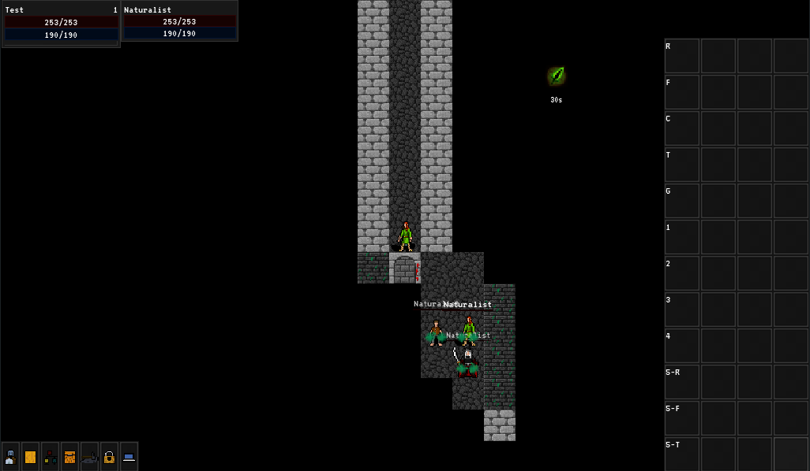

# Broken Seals Roguelike

An experimental 2d roguelike version of Broken Seals.

It is on an early tech demo level currently. It has everything architeturally, but it has no real content, it however does 
show how to set up entity spell system for a turn based game.

This project now uses the , which is my custom version of godot.

The project also requires the presence of some of my engine modules, Pandemonium contains all of them. See [here](https://github.com/Relintai/pandemonium_engine/tree/master/modules).

You can get binaries under the releases tab [here](https://github.com/Relintai/broken_seals_roguelike/releases).\
You can also try a live version running in the browser [here](https://relintai.github.io/broken_seals_roguelike/).

Unfortunately the web editor needs custom http headers to work and I can't set that up from github.io, so right now I don't have a hosted version of that.

#### Screenshot



## Status 

Currently I'm mostly working on the 3d project and the engine, eventually I'll likely get back to this to try to add
some actual content.

## Features

### Characters

- Main and secondary stats all work, they are also customizable in the project settings. They also have built in maint stat -> secondary stat conversion support.
- Character resources all work and scriptable. (Like health, mana, speed, energy etc) Also you can dynamically add it and remove it from a character.
- Tab targeting support.
- Spells, and auras are fully scriptable, and networked.
- Actionbar, actionbar profiles support.
- Spell learning support.
- Talent support, with multiple talent trees.
- Loot.
- Equipment support including weapons, clothes, and also other attachments. Although starter gear support is not yet finished.
- Support for changing clothes via texture merging.
- Support for changing parts of models via clothes. Also support for alternative bodyparts.
- Character models are using merged meshes and textures, with generated LOD. (This is also multi threaded, with fallback when no threads are available.) This system is using MeshDataResources.
- Generic attach point support for the character skeletons. (Spell cast particle effects, spell effects, also the same system can be used for weapons.)
- Interaction support.
- Vendors, Trainers, Crafting.
- Fully scriptable ai support.
- Control over characters can be easily changed by the server, and the character bodies are scripted to act accordingly automatically. For example mind control effects can be implemented with this system.

Missing:

- Character customization support (like selecting hairtyles). It's mostly there, but some crucial features are still missing.
- Temporary character model change support. Think of polymorph effects, toys etc. Needs the character customization support first.

### Dungeons

- Randomly generated dungeons.
- Multiple layers.
- Simple Fog of War implementation using Bresenham's line algorithm (should eventually switch to something like Mingos' Restrictive Precise Angle Shadowcasting (MRPAS)).
- Collision.

### UI

- Menu and game ui.
- Actionbars with keybind support. Also the icons that you drag to the actionbar actually gets merged into the ui's texture to reduce drawcalls.
- Character, talent, spellbook, crafting, inventory, loot, vendor, trainer windows are all implemented.
- Easily scriptable options dialog.
- The menu has full support for keyboard / controller navigation. (The game itself misses it at the moment though.)
- Touchscreen controls. It will also make the buttons bigger if it detects a touchscreen.
- Keybind window.
- About window.

## Project overview

As stated in the opening section the project uses a custom version of the godot engine.

The project's workflow has been set up so you can easily compile this version for yourself if you want to.

See the [Compiling](#compiling) section if you want to know how to do this.

### Engine

Currently the [Pandemonium Engine](https://github.com/Relintai/pandemonium_engine) is used as the engine for this project,
which is a heavily customized verison of the [Godot game engine](https://godotengine.org/). It's based on the 3.x branch. 

It contains my engine modules, and also it got significanlty slimmed down compared to vanilla Godot.

For a more in-depth changelog see it's changelog file [here](https://github.com/Relintai/pandemonium_engine/blob/master/CHANGELOG.md).

### Game

The [/game](https://github.com/Relintai/broken_seals_roguelike/tree/master/game) folder contains the game's code and assets.
This is the folder you are supposed to open in the editor.

The game's folder structure should be (hopefully) mostly self explanatory.

#### Game Modules

I designed the game's code to be highly modular, so I created a [loader module](https://github.com/Relintai/broken_seals_roguelike/tree/master/game/scripts/game_modules). \
It will look for files named ` game_module.tres ` and call methods on them on certain events.\
This system uses the [DataManager](https://github.com/Relintai/broken_seals_roguelike/blob/master/game/scripts/game_modules/DataManager.gd) singleton.

For example this is how the ui initializes itself:

The player's [body](https://github.com/Relintai/broken_seals_roguelike/blob/master/game/player/Body.gd) script requests the ui nodes from the [DataManager](https://github.com/Relintai/broken_seals_roguelike/blob/master/game/scripts/game_modules/DataManager.gd) singleton (like ` var ui = DataManager.request_instance(DataManager.PLAYER_UI_INSTANCE) `). And then the data manager will instance it's ` player_ui ` scene, and call all module's ` on_request_instance ` methods, while also passing the newly instanced scene to them.

These module scripts are also responsible for collecting all spells and then setting them into the ESS singleton, so they are actually castable.

This is the [module](https://github.com/Relintai/broken_seals_roguelike/blob/master/game/modules/entity_classes/naturalist/game_module.tres) for the naturalist, and it's [ResourceDB](https://github.com/Relintai/broken_seals_roguelike/blob/master/game/modules/entity_classes/naturalist/resource_db.tres), which will be merged into a central resource db for ESS. 

Note that the module resources are sorted by their resource paths, so spells should always get the same id, on every platform every time.
This is to optimize networkd spell casts.

## Editing the game

Grab the engine itself, and then open the project inside the `game` folder.

After the initial import it might need an editor restart, however everything should work after that.

If you want to use master, you will likely need to build the editor for it if the c++ side had breaking changes since the last release.

## Compiling

First make sure, that you have everything installed to be able to compile the engine. 
See the [official docs for compiling Godot](https://docs.godotengine.org/en/3.4/development/compiling/index.html) for more info. 
My setup/compile script uses the same tools, so you don't need to install anything else.

Even though the project doesn't use godot anymore, their docs are still sufficient.

Now let's clone this repository:

``` git clone https://github.com/Relintai/broken_seals_roguelike ```

cd into the new folder:

``` cd broken_seals_roguelike ```

Now let's run the project's setup script, by calling scons without arguments.

``` scons ```

This will clone and setup the engine, and all of the required modules into a new `engine` folder inside the project, using http.

(If you want to use the github's ssh links append `repository_type=ssh` like ``` scons repository_type=ssh ```)

Once it is done you can compile the engine.

To build the editor on windows with 4 threads run the following command:

``` scons bew -j4 ```

To build the editor on linux with 4 threads run the following command:

``` scons bel -j4 ```

I call this feature of the setup script build words. [See](#build-words).

Once the build finishes you can find the editor executable inside the `./engine/bin/` folder.

For convenience there is a provided `editor.sh`, or `editor.bat` for running it from the project's folder.
These will create a copy, so you can even compile while the editor is running.

Alternatively if you don't want to use build words, you can also just go into the engine folder:

``` cd engine ```

And compile godot as per the [official docs](https://docs.godotengine.org/en/latest/development/compiling/index.html).

### Build words

The project's setup script contains support for "build words". These can be used from the root of this project.

For example to build the editor for windows with 4 threads you can use:

``` scons bew -j4 ```

The first argument must start with b (build), then it needs to be followed by a few abbreviations (the order does not matters)

The rest of the arguments will be passed directly to godot's scons script.

#### Editor

Append `e` to build with `tools=yes` a.k.a. the editor.

``` scons bew -j4 ```

if you omit `e`, the system will build the export template for you. For example:

``` scons bw -j4 ```

This will be the `release_debug` windows export template.

#### Platform abbreviations

`l`: linux \
`w`: windows \
`a`: android \
`j`: Javascript \
`i`: iphone (Not yet finished, use `build_ios.sh`, and `build_ios_release.sh`) \
Mac OSX: Not yet finished, use `build_osx.sh`

#### Target abbreviations

By default the system builds in release_debug.

Append `d` for debug, or `r` for release.

``` scons bewd -j4 ```

build editor windows debug

``` scons bwr -j4 ```

build windows release (this will build the windows release export template)

#### Shared modules

Note: This only works on linux!

append `s` to the build string. 

Optionally you can also make the build system only build a target module, by appending one of these:

`E`: Entity Spell System \
`T`: Texture Packer \
`V`: Voxelman \
`W`: World Generator \
`P`: Procedural Animations

Example:

``` scons belsE -j4 ```

build editor linux shared (Entity Spell System) with 4 threads

Note: to easily run the editor you can use the `editor.sh` or `editor.bat` in the root of the project.

#### Other

Append `v` to pass the `vsproj=yes` parameter to the build script. This will generate Visual Studio project files.\
Append `c` to pass the `compiledb=yes` parameter to the build script. This is a new feature in 3.x to have this disabled by default to lessen compile times.

#### Postfixes

There are a few postfixes for the build words. These are more complex options. You have to append them to your build word with an underscore.

You can use as many as you want.

For example:

``` scons bel_slim_latomic -j4 ```

##### slim

With this postfix you can build a slimmed down version of the engine. This disables quite a few unneeded modules.

``` scons bel_slim -j4 ```

##### latomic

If you get linker errors while building the game/editor about undefined referenced with atomic related functions you can use this postfix.
It will add the ` -latomic ` command line switch to the linker flags.

I ran into this issue while building on a raspberry pi 4 with the x11 platform. It might be related to the recent reworks to threading.

``` scons bel_latomic -j4 ```

##### strip

Appends `debug_symbols=no` to the build command, which will strip the resulting binary from debug symbols.

``` scons bel_strip -j4 ```

##### threads

Appends `threads_enabled=yes` to the build command. Useful for building the editor for html.

``` scons bej_threads -j4 ```

#### Scons cache, and sdk locations

In order to use scons cache and to tell the build system where some of the required sdks are located you usually 
have to use environment variables. Most of the time you might just want to add them globally, 
howewer this is sometimes unfeasible (e.g. you don't have administrator access, or you just want to have
multiple sdk versions installed).

In order to solve this a build config file was added.

If you want to use the config simply rename the provided `build.config.example` to `build.config`, and customize 
the settings inside.

### Manual Setup

If you you don't want to use the setup script (or just want to know what it actually does), 
this section will explain how to set everything up manually.

First clone the engine:

``` git clone https://github.com/Relintai/pandemonium_engine ```

Now if you look at the [HEADS file](https://github.com/Relintai/broken_seals_roguelike/blob/master/HEADS).

It contains the commit hashes for that particular revision for every module and the engine.
The engine now contains all the modules, so at the moment only worry about the engine's commit hash.

You need to go and checkout the proper commit for it.

Now you can go ahead and compile the engine normally.

## Pulling upstream changes

First pull the changes by calling

``` git pull orgin master ```

Then just run `scons`, to will update the modules.

## Upgrading the modules

Note: this is how to update the HEADS file. Normally you don't need to do this.

If you want to update the modules, and the engine to the latest, you can use (`action=update`):

``` scons a=u ``` 

You can also update different targets: `all`, `engine`, `modules`, `all_addons`, `addons`, `third_party_addons`

For example to update the engine to the latest: ``` scons a=u target=engine ```
